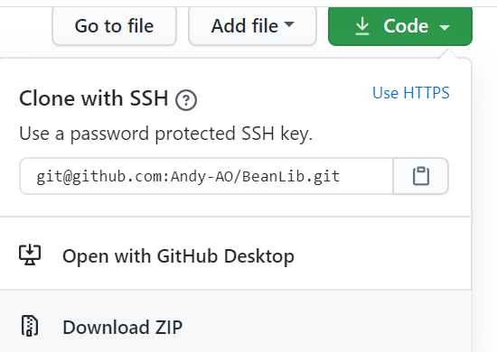
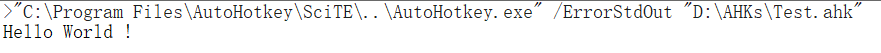

在此之前，确保

安装 [AutoHotKey](https://autohotkey.com) 的 Unicode-32 版本 和 [SciTE4AutoHotkey](https://autohotkey.com/boards/viewtopic.php?t=62)

# 1. 下载 
在 [GitHub](https://github.com/Andy-AO/BeanLib) 中[打包下载](https://github.com/Andy-AO/BeanLib/archive/master.zip)，然后解压到需要使用BeanLib的脚本的同级目录。



# 2. 导入 

1. 打开 SciTE4AutoHotkey，按下 Ctrl+N 新建文件，输入以下代码

  ```autohotkey
  #Include BeanLib\BeanLib.ahk
  logPrintln("Hello World !")
  ```
1. 将这个脚本保存到，BeanLib文件夹的同级别文件夹，并按下 F5 运行脚本。
    如无意外，出现 HelloWorld 表示库已经部署成功。


   )

# 3. 后续
- 在需要导入的脚本的最顶部加入 `#Include` ，即可调用库类和函数，具体详见 `#Include` 官方文档。
- 使用库时，遇到问题请先先查阅文档，大多数的问题都已经有解决方案。如果无法解决也可以联系我。
- 可以导入代码高亮，如果不导入也不影响库的使用，相关内容请查看[语法高亮(HIGHLIGHTING)](HIGHLIGHTING.md)的说明文档。